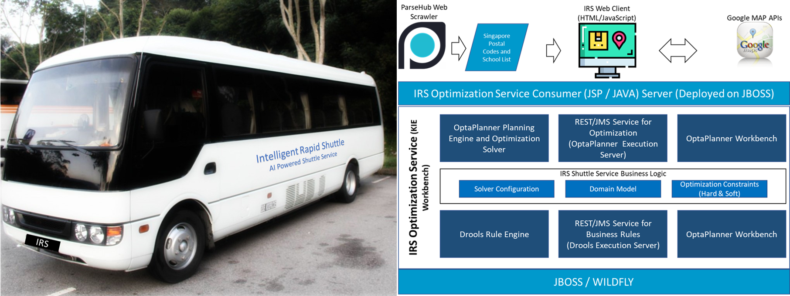
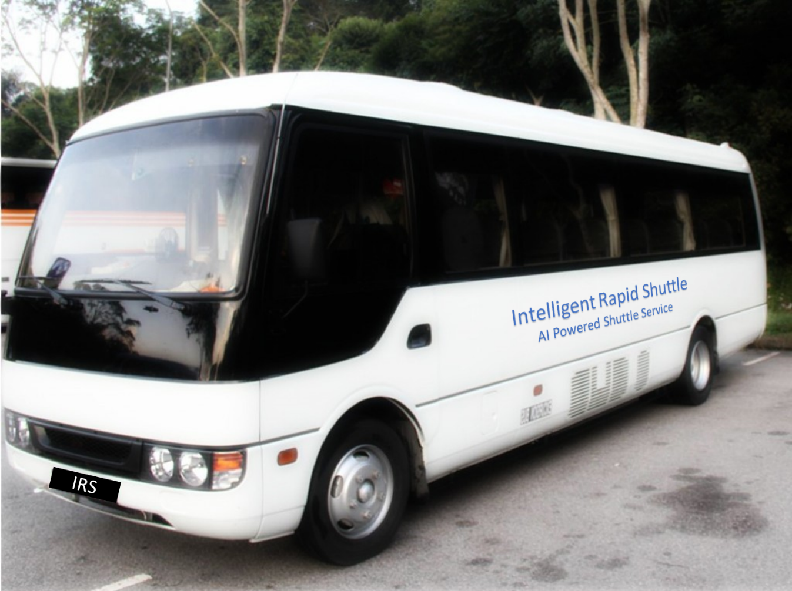
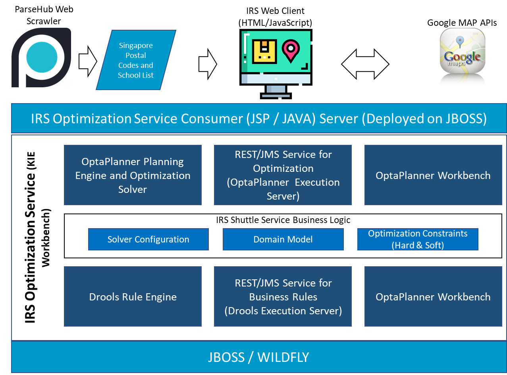
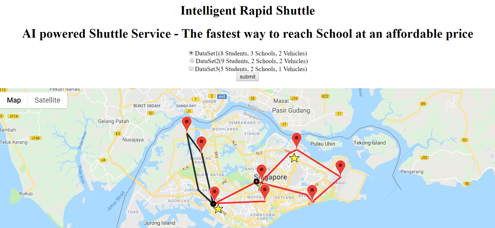
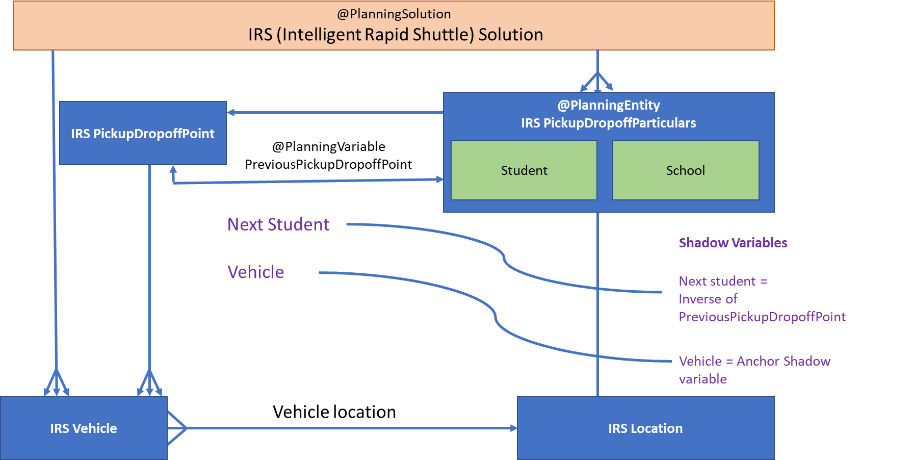

## SECTION 1 : PROJECT TITLE
## Intelligent Rapid Shuttle (IRS) System

 
 
<!---
 
-->
## SECTION 2 : EXECUTIVE SUMMARY / PAPER ABSTRACT
In Singapore shuttle services to ferry students from their home to school and back is quite common. Probably every Singaporean would have travelled in a shuttle service during their student days.

Our team of 4 Singapore residents have also gone through the process of selecting shuttle services for our school going children and the biggest challenge we found was to find a service which takes the shortest distance to reach the school from our house at a reasonable cost and able to service multiple schools at the same time. 

We believe that many other Singapore parents would also be finding similar difficulties in selecting shuttle services for their children for a nominal cost. This provides a greater opportunity to address the gap in the market and thus we decided to embark on this project. In this project, we are assuming that we are a service provider having few depots operating shuttle buses at our disposal. We would be providing shuttle services optimized through the implementation of Reasoning Systems Optimization techniques using KIE workbench, Drools and OptaPlanner.  

We felt that the scale and scope of the project was such that many more options for optimization could have been explored e.g. the amount of time taken for students to reach school taking traffic conditions in to consideration on top of travel distance optimized. However, given the time limitations we were happy with the solution we were able to achieve as part of this project.  

Project Git Repository : https://github.com/aivoyagers/IRS-RS-2019-03-09-IS1PT-GRP-aiVoyagers-irs-Intelligent-Rapid-Shuttle.git

---
## SECTION 3 : CREDITS / PROJECT CONTRIBUTION

| Official Full Name  | Student ID (MTech Applicable)  | Work Items (Who Did What) | Email (Optional) |
| :------------ |:---------------:| :-----| :-----|
| SUDALAIANDI RAJA SUDALAIMUTHU | A0195338U |OptaPlanner Solver configuration, Class Diagram, Data Model, Drools Rules development for Constraints, Systems Architecture, Project video, Input Data Preparation and revision to Report, Userguide and Readme | E0384969@u.nus.edu |
| JAYARAMAN REVATHI | A0195357R | Webpage Design and Client Side Programming, Google Map Plotting, Integration of webpage to KIE Server | E0384988@u.nus.edu |
| JAYASRI RAGHUNATHAN | A0005978U | ParseHub Web Scraping, Randomize Input data generation, Async Javascript web Client Programming | E0384183@u.nus.edu |
| SUNIL VARGHESE | A0195247W | Final Submission Report, User Guide, Readme  | E0384878@u.nus.edu |

---
## SECTION 4 : VIDEO OF SYSTEM MODELLING & USE CASE DEMO

Click the image above to view Video. Alternatively, you can view following the link https://github.com/aivoyagers/IRS-RS-2019-03-09-IS1PT-GRP-aiVoyagers-irs-Intelligent-Rapid-Shuttle/blob/master/Video/IRSVideo.MOV

---
## SECTION 5 : USER GUIDE
IRS((Intelligent Rapid Shuttle) is a web based shuttle services optimizer. It would be used by the service provider to achieve the shortest overall distance between locations. The routes would be shown visually on the google map to enable the service provider to navigate easily. 

+	git clone https://github.com/aivoyagers/IRS-RS-2019-03-09-IS1PT-GRP-aiVoyagers-irs-Intelligent-Rapid-Shuttle.git
+	Unzip irs-Intelligent-Rapid-Shuttle.zip from SystemCodes folder and Import the project in to KIE
+	Build and Deploy to the execution server of KIE workbench
+	Copy the intelligentrapidshuttle-0.0.1-SNAPSHOT.war file to the JBOSS server by issuing the following command: (Note : change the destination folder specific to your installation of jboss server)
	+ cp SystemCodes/intelligentrapidshuttle-0.0.1-SNAPSHOT.war /home/iss-user/iss-vm-program/is-intelligent-reasoning-systems/jboss/jbpm-server-7.12.0.Final-dist/standalone/deployments/

+	As it uses Google Map services for visualization of Optimization output, please ensure that you are connected to internet. Internet access is required. 
+	This application invokes KIE server and the default userid ‘wbadmin’ and default password is used to signon to KIE. If your wbadmin default password is changed in KIE, please update the program with correct userid and password in the project IRSWeb-intelligentRapidShuttle project from the zip file available in SystemCodes folder. Build and Install on to JBOSS server as required.
	+ (Note : Skip Step 9, if your default password for ‘wbadmin’ is left unchanged in KIE) 
+	Go to web browser and key in the url: 
http://localhost:8080/intelligentrapidshuttle-0.0.1-SNAPSHOT/IRSIndex.jsp
 
---
## SECTION 6 : PROJECT REPORT / PAPER
### Table of Contents

* Executive Summary
* Business Problem Background
* Project Objective
* Project Solution
* Project Scope
* System Features
* Limitations
* Conclusion
* Improvements

---
## SECTION 7 : MISCELLANEOUS

### 7.1 Domain Class Diagram  
 

### 7.2 IRS Systems Artchitecture  
 

---
